# Proving you are an adult without telling anyone who you are  
> *Alexandre 'kidev' Poumaroux*   

[](https://doi.org/10.5281/zenodo.21547770) 

[English](#english) | [Français](#français)

## English

### The problem

Age verification laws are spreading, and every mechanism deployed so far makes you pay with your privacy: either you show your ID or your face to the website, or a verification company learns which sites you visit. Both build databases whose mere existence is the danger.

### The idea

This project describes and implements a protocol where a website can check "this visitor is an adult certified by the government" while it remains mathematically impossible, for the website, for the government, or for both working together, to ever find out who you are or where you go. Not forbidden. Impossible.

It works in two steps.

**Step one, once in your life: enrollment.** Your wallet, an open-source app on a device you own, invents a secret, entirely offline, and scrambles it into a code. Only the code is sent to the government, which checks you are an adult and adds it to one big public list. The government may remember forever that this code is yours: it is harmless, because the code never appears anywhere again.


**Step two, every visit: proving.** When a website asks for proof of age, the wallet produces a zero-knowledge proof, a cryptographic technique established in the 1980s: it convinces the website that your secret matches some code on the public list, without indicating which one. Think of the list as one closed chain made of millions of padlocks, and imagine you wear a mask. You hold the key to exactly one padlock. To prove you are an adult, you never point at your padlock and never show your face: you simply open the chain. Since a chain can only be opened by unlocking one of its padlocks, everyone is convinced you own a valid key, yet nobody has any idea which padlock you unlocked. The website checks the proof on its own, offline. The government is never contacted, so no record of your visit can ever exist on its side.



**What websites see.** Each site gets a nickname for you that only works there and only for a month, so you can log back in without accounts or cookies. Nicknames on different sites have no mathematical relationship to each other. Even if every website and the government pooled all their data, there is nothing to join it on.



**What cheaters get.** Replayed tokens, tokens relayed from another site, and proofs fabricated without an enrolled secret are all rejected by the verifier, with odds of slipping through below 1 in 2^128.



**Not just 18.** Nothing here is specific to the age of majority. A country whose laws use several thresholds (13, 15, 16, 18) publishes one list per threshold; your wallet is on every list it qualifies for, with the same secret. A site checks exactly one threshold and learns one bit ("old enough"), never your age bracket. And this does not rest on sites behaving: the threshold is baked into the mathematics of the proof, so a proof made for the 13+ list fails against every other list, for adults and teens alike, and a token works once and only once. The only thing a site can still do is ask your wallet to prove a different threshold, and the wallet always shows you what a site wants to check: if a domain changes its declared threshold or asks for a second one, every wallet interrupts with the same clear warning, whatever your age, and proceeds only if you explicitly insist. One threshold, one bit, and any probing attempt lands on your screen instead of happening behind your back.



### Why you can trust it

The guarantee does not depend on anyone behaving well. All the mathematics is public, all the code is open source, and every security property is proven in the paper, including against quantum computers. The full protocol, its formal proofs, its measured performance, and an honest list of what it cannot do (nothing stops an adult from lending their credential) are in the article:

**Read the full paper: [English (PDF)](paper/paper.pdf) | LaTeX sources in [`paper/`](paper/)**

### Try it

```sh
pip install dilithium-py cryptography
make test     # full test suite
make demo     # every scenario and every attack, end to end
```

A native Rust implementation of the prover and verifier lives in [`code/rust/`](code/rust/), cross-checked against the Python reference. Same protocol, about fifteen times faster: full-parameter proofs in about a third of a second.

```sh
make rust          # build + selftest: KATs against the Python reference, end to end
make rust-bench    # prove/verify timings at d=32, tau=219
make interop       # cross-verify Rust <-> Python
```

---

## Français

### Le problème

Les lois de vérification d'âge se multiplient, et chaque mécanisme déployé jusqu'ici vous fait payer avec votre vie privée: soit vous montrez votre pièce d'identité ou votre visage au site, soit une société de vérification apprend quels sites vous visitez. Les deux construisent des bases de données dont l'existence même est le danger.

### L'idée

Ce projet décrit et implémente un protocole où un site web peut vérifier que " ce visiteur est un adulte certifié par le gouvernement " tandis qu'il reste mathématiquement impossible, pour le site, pour le gouvernement, ou pour les deux réunis, de jamais découvrir qui vous êtes ou où vous allez. Pas interdit. Impossible.

Cela fonctionne en deux étapes.

**Étape un, une fois dans votre vie: l'inscription.** Votre portefeuille, une application open source sur un appareil qui vous appartient, invente un secret, entièrement hors ligne, et le brouille en un code. Seul le code est envoyé au gouvernement, qui vérifie que vous êtes majeur et l'ajoute à une grande liste publique. Le gouvernement peut retenir pour toujours que ce code est le vôtre: c'est sans danger, car le code ne réapparaît plus jamais nulle part.



**Étape deux, à chaque visite: la preuve.** Quand un site demande une preuve de majorité, le portefeuille produit une preuve à divulgation nulle de connaissance (zero-knowledge), une technique cryptographique établie depuis les années 1980: elle convainc le site que votre secret correspond à un des codes de la liste publique, sans indiquer lequel. Imaginez la liste comme une seule chaîne fermée faite de millions de cadenas, et imaginez que vous portez un masque. Vous détenez la clé d'exactement un cadenas. Pour prouver votre majorité, vous ne désignez jamais votre cadenas et vous ne montrez jamais votre visage: vous ouvrez simplement la chaîne. Comme une chaîne ne peut s'ouvrir qu'en déverrouillant un de ses cadenas, tout le monde est convaincu que vous possédez une clé valide, mais personne n'a la moindre idée du cadenas que vous avez ouvert. Le site vérifie la preuve tout seul, hors ligne. Le gouvernement n'est jamais contacté, donc aucune trace de votre visite ne peut exister de son côté.



**Ce que voient les sites.** Chaque site reçoit un surnom pour vous qui ne fonctionne que là et pendant un mois, pour que vous puissiez vous reconnecter sans compte ni cookies. Les surnoms de sites différents n'ont aucun rapport mathématique entre eux. Même si tous les sites et le gouvernement mettaient toutes leurs données en commun, il n'y a rien pour les joindre.



**Ce qu'obtiennent les tricheurs.** Les jetons rejoués, les jetons relayés depuis un autre site et les preuves fabriquées sans secret inscrit sont tous rejetés par le vérifieur, avec moins d'une chance sur 2^128 de passer.



**Pas seulement 18 ans.** Rien ici n'est propre à la majorité. Un pays dont les lois utilisent plusieurs seuils (13, 15, 16, 18) publie une liste par seuil; votre portefeuille figure sur chaque liste à laquelle il a droit, avec le même secret. Un site vérifie exactement un seuil et apprend un seul bit ("assez âgé"), jamais votre tranche d'âge. Et cela ne repose pas sur la bonne conduite des sites: le seuil est incorporé dans les mathématiques de la preuve, donc une preuve faite pour la liste 13+ échoue contre toute autre liste, pour les adultes comme pour les mineurs, et un jeton fonctionne une fois et une seule. La seule chose qu'un site peut encore faire est de demander à votre portefeuille de prouver un autre seuil, et le portefeuille vous montre toujours ce qu'un site veut vérifier: si un domaine change de seuil déclaré ou en demande un second, tout portefeuille s'interrompt avec le même avertissement clair, quel que soit votre âge, et ne continue que si vous insistez explicitement. Un seuil, un bit, et toute tentative de sondage atterrit sur votre écran au lieu de se produire dans votre dos.



### Pourquoi lui faire confiance

La garantie ne dépend de la bonne conduite de personne. Toutes les mathématiques sont publiques, tout le code est open source, et chaque propriété de sécurité est prouvée dans l'article, y compris face aux ordinateurs quantiques. Le protocole complet, ses preuves formelles, ses performances mesurées et la liste honnête de ce qu'il ne peut pas faire (rien n'empêche un adulte de prêter son justificatif) sont dans l'article:

**Lire l'article complet: [Français (PDF)](paper/paper.fr.pdf) | Sources LaTeX dans [`paper/`](paper/)**

### Essayer

```sh
pip install dilithium-py cryptography
make test     # suite de tests complète
make demo     # tous les scénarios et toutes les attaques
```

Une implémentation Rust native du prouveur et du vérifieur se trouve dans [`code/rust/`](code/rust/), contre-vérifiée avec la référence Python. Même protocole, environ quinze fois plus rapide: des preuves aux paramètres complets en environ un tiers de seconde.

```sh
make rust          # build + selftest: tests à réponses connues contre la référence Python
make rust-bench    # temps de preuve/vérification à d=32, tau=219
make interop       # vérification croisée Rust <-> Python
```
